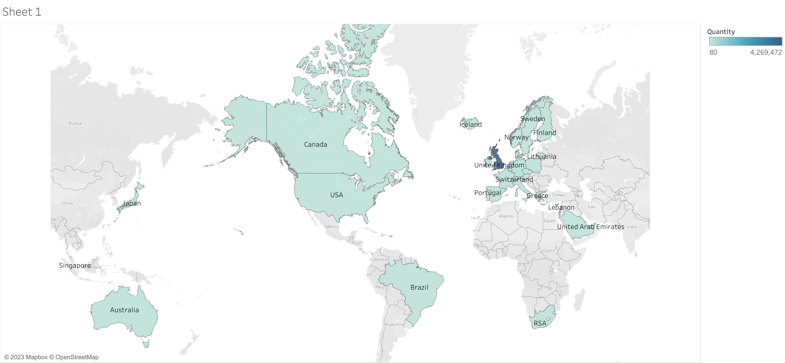
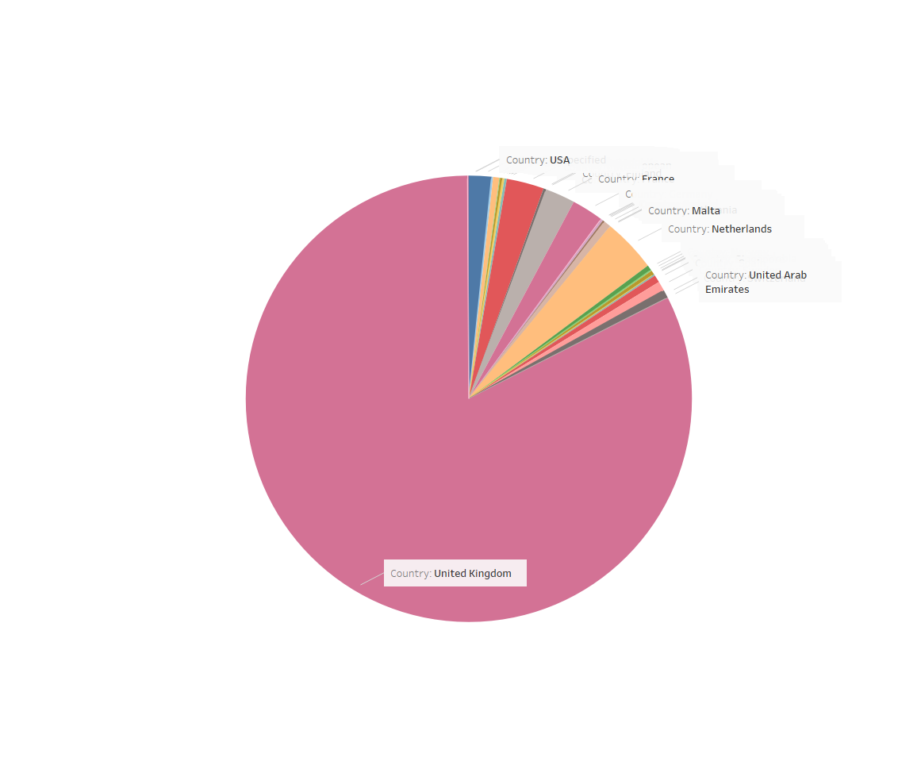

Title: E-commerce Sales Analysis

Objective: To analyze sales data and identify trends, insights, and opportunities.

Tools Used: SQL (Big Query), Tableau, R programming.

Dataset: https://www.kaggle.com/datasets/carrie1/ecommerce-data

Process:

SQL: Data cleaning, removing duplicates, handling null values, calculating total sales.
  
Tableau: Visualizing sales over time, customer counts by country.
  
R Programming: Advanced analysis, handling outliers, calculating total sales per invoice.

Results: UK is the primary driver of sales.

Conclusion: Focus on marketing in the UK for growth.

## Tableau Visualizations
1. **Top 10 Countries by Total Sales**  

### SQL Script

You can view the full SQL script used for the analysis here:  
[**ecommerce_sales_analysis.sql**](./ecommerce_sales_analysis.sql)

### R Script

You can view the R script used for further analysis and visualizations here:  
[**ecommerce_sales_analysis.R**](./ecommerce_sales_analysis.R)

